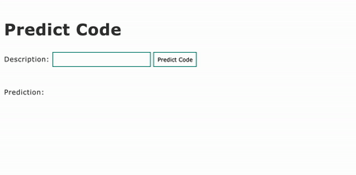

# my_first_flask_app
Simple flask app with web UI. Takes text input. When button clicked it displays the text that was input.

To run the app:

- download al the files and keep the same folder structure.
- in your terminal, go to the folder that contains these files
- run `export FLASK_APP=my_first_flask.py`
- run `flask run`
- copy the URL that is printed in the terminal, and paste it into a browser

